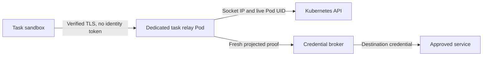

# A task sandbox without identity credentials

Run a separate trusted relay for each managed Kubernetes task. The sandbox holds
public connection settings and placeholders. The relay holds the short-lived
identity proofs and authenticates to the credential broker. This keeps a process
inside the sandbox from reading or copying a login credential.

The implementation and local synthetic tests are supplied here. Deployed network
isolation, real service integration and other sandbox runtimes need separate
acceptance. This is not a published upstream Agent Vault feature.

## Trust and request flow



An operator pins the task ID, deadline, sandbox namespace/name/UID/IP and approved
services in a read-only configuration. The relay matches the actual socket peer
IP to that configuration, checks the live Pod is Running and not deleting, then
uses the fixed policy. Caller headers, labels, annotations and request parameters
cannot select an identity, proof file, broker, vault or destination policy.

The broker authenticates the **relay Pod**, not the sandbox Pod. Bind that relay's
service account and Pod UID to the intended broker actor and vault. The relay's
durable journal records the operator's task-to-sandbox mapping. Use a separate
service account when different tasks need different broker actors.

The sandbox must not contain projected identity tokens, service-account token
mounts, reviewer credentials, TLS private keys, browser cookies, broker handles
or destination credentials. Disabling automatic token mounting does not remove
an explicit projected-token volume. A local TLS client needs only public trust
material. Every process inside the paired sandbox can use its approved relay
capabilities; the relay does not distinguish individual processes or intentions.

## Configure and start

1. Build this checkout with `make build`. Package the resulting `agent-vault`
   binary in the operator's trusted relay image.
2. Copy [config.example.json](config.example.json) into operator-owned configuration.
   Its deadline is deliberately expired and its Pod values are examples. Obtain
   the real UID and IP from the trusted control plane, not from sandbox input:

   ```sh
   kubectl get pod TASK_POD -n TASK_NAMESPACE -o jsonpath='{.metadata.uid}{"\n"}{.status.podIP}{"\n"}'
   ```

   Set an RFC3339 deadline in the future, no more than eight hours after startup.
   Recreating the sandbox requires a new reviewed pairing.
3. Mount only in the relay: a server certificate/key, trusted API/broker
   certificate authorities, API reviewer token, and projected proof files for
   each configured broker audience. Grant the reviewer `get` only for the paired
   Pod. Use verified broker TLS ingress, not the broker's loopback plaintext port.
4. Mount a dedicated persistent audit volume at `/data/task-relay`. The process
   must be able to append and synchronize `audit.jsonl` and synchronize its parent
   directory. The persistent volume must honor both operations; local tests do
   not establish node-crash durability. Startup mapping,
   admissions and terminal outcomes contain task ID and sandbox UID, never
   proofs, request bodies, destination URLs or raw errors. Reusing a volume
   appends records with their original identities; rotation and retention are
   operator responsibilities. Audit failure refuses work and stops the task.
5. Start only inside the trusted relay Pod:

   ```sh
   agent-vault task-relay --config /etc/task-relay/config.json
   ```

There are no task-relay environment flags. Unknown configuration fields, invalid
addresses, missing protocol configuration and deadlines outside the permitted
window fail startup. At least one protocol must be configured. Optional protocol
sections must have usable trust files when present; omit a section until ready.

## Client and protocol contract

| Surface | Sandbox sends | Relay behavior |
|---|---|---|
| HTTP | CONNECT to an exact approved host:port, without proxy credentials | Injects fresh proof into the fixed broker connection; returns no broker headers. The inner HTTPS request still follows the broker's approved placeholder and read-only policy. |
| PostgreSQL | Fixed database/user and the configured public placeholder password | Replaces the password with proof; keeps actual database credentials at the broker. Preserves optional `client_encoding=UTF8`, a printable ASCII `application_name` of at most 63 bytes, and a positive decimal `statement_timeout` in milliseconds (at most 2147483647). Other startup fields are denied. |
| Browser | POST `{}` with `Content-Type: application/json` to the fixed relay route | Uses one fixed task and a private broker session handle; returns only readiness, a boolean check or closure. |

All relay listeners use native TLS so the actual peer address survives. A
sandbox-local TLS tunnel can expose plain HTTP proxy/PostgreSQL ports on
loopback while verifying the relay certificate and server name. PostgreSQL uses
this **outer TLS** transport; do not request a second PostgreSQL SSL negotiation
inside it. Unsupported startup options, replication, caller identity headers and
caller-selected destinations are refused.

The statement timeout preserves client behavior; it is not an authorization control.
Database permissions still govern queries, including any permitted session changes.

PostgreSQL cancellation uses a random relay-local key scoped to the active
session. The relay checks the pairing again and maps that key to the established
broker connection. Broker cancellation keys never reach the sandbox; stale and
unknown local keys are refused.

For browser support, add an optional `browser` object with `listen` and the same
`upstream` fields used above. Its fixed HTTPS endpoint must use an address host
matching `serverName`, and its proof audience must match the browser broker.
The top-level `taskID` must name a task configured there. The routes are:

- `/v1/browser/tasks`: returns HTTP 201 with `ready` and `expiresAt`.
- `/v1/browser/check`: returns `matched` for the broker's fixed visibility check.
- `/v1/browser/close`: returns `closed`.

A duplicate or uncertain create returns 409; do not blindly retry. Browser
closure is attempted on withdrawal and deadline, using a fresh relay proof even
after task admission has ended. Failed physical closure or audit recording
returns a failed relay exit. Broker session expiry remains the crash fallback.

The relay admits at most 32 concurrent operations and caps each listener at 32
connections. Handshakes have a ten-second bound. Every admission checks the live
pair; a one-second watcher with a three-second API timeout stops active streams
on pair loss or API failure. HTTP/PostgreSQL streams also expire no later than
their admitted proof or task deadline. Reconnect to use a rotated proof.

## Verify and record acceptance

From this checkout:

```sh
GOTOOLCHAIN=go1.26.8 go test -race -count=1 ./internal/taskrelay ./internal/pgproxy ./internal/mitm ./cmd
```

The relay tests use local TLS listeners, a synthetic Kubernetes API and synthetic
broker responses. They cover proof custody, fresh proof reads, peer/UID checks,
withdrawal during handshake, deadline closure, audit refusal, request bounds,
PostgreSQL cancellation isolation and browser cleanup. They do not establish a
real identity issuer, actual TypeORM connectivity or deployed network enforcement.

Before enabling a task, the deployment operator must complete these checks and
record results in the deployment change request:

- [ ] Restrict sandbox egress to its relay and required DNS; restrict relay ingress
  to its sandbox. Deny direct broker/API/destination access and access to another
  task's relay. Prevent the sandbox from editing its Pod, labels, policies or the
  operator configuration. Disallow host networking and shared credential volumes.
  Result/evidence: pending. Reviewer/feedback: pending.
- [ ] Confirm the real CNI preserves the expected source IP and prevents spoofing.
  Exercise the approved request and a sibling-Pod impersonation attempt. Network
  address translation that changes the peer IP must fail closed.
  Result/evidence: pending. Reviewer/feedback: pending.
- [ ] Exercise real HTTP/database clients, identity rotation, Pod replacement,
  API denial, task expiry, full audit storage and restart. Confirm forbidden
  requests create no destination call or credential issuance.
  Result/evidence: pending. Reviewer/feedback: pending.
- [ ] Review browser broker policy, actual login custody and physical closure
  separately before adding its listener. No full application journey is claimed.
  Result/evidence: pending. Reviewer/feedback: pending.

Record the tested revision, environment, command, expected/observed result and
sanitized evidence link beside each result. When these checks are accepted, the
paired Kubernetes task can use its approved services without holding an identity
credential. Other hosted-agent runtimes require their own trustworthy sandbox
identity and isolation integration.

### Unknown browser creation

If a create response is lost or malformed, the broker may own a live browser
whose handle the relay never received. The relay refuses further task calls
and never retries creation blindly. Shutdown records `cleanup-unknown` and
returns a failed exit; it does not claim physical closure. Inspect the broker's
private audit and session state and confirm expiry or operator cleanup before
accepting the task as closed. A close-by-task recovery operation is not provided.
