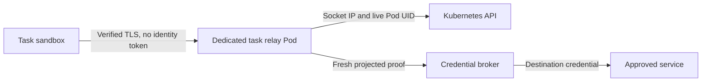

# A task sandbox without identity credentials

Run a separate trusted relay for each managed Kubernetes task. The sandbox holds
public connection settings and placeholders. The relay holds the short-lived
identity proofs and authenticates to the credential broker. This keeps a process
inside the sandbox from reading or copying a login credential.

The implementation and local synthetic tests are supplied here. Deployed network
isolation, real service integration and other sandbox runtimes need separate
acceptance. This is not a published upstream Agent Vault feature.

## Trust and request flow


```mermaid
flowchart LR
  A[Task sandbox] -->|Verified TLS, no identity token| R[Dedicated task relay Pod]
  R -->|Socket IP and live Pod UID| K[Kubernetes API]
  R -->|Fresh projected proof| B[Credential broker]
  B -->|Destination credential| D[Approved service]
```

An operator pins the task ID, deadline, sandbox namespace/name/UID/IP, task container name and approved
services in a read-only configuration. The relay matches the actual socket peer
IP to that configuration, checks the live Pod is Running and not deleting, and
requires the named task container to be running with zero restarts. A surviving
transport sidecar cannot keep an exited task authorized. The relay then
uses the fixed policy. Caller headers, labels, annotations and request parameters
cannot select an identity, proof file, broker, vault or destination policy.

The broker authenticates the **relay Pod**, not the sandbox Pod. Bind that relay's
service account and Pod UID to the intended broker actor and vault. The relay's
durable journal records the operator's task-to-sandbox mapping. Use a separate
service account when different tasks need different broker actors.

The sandbox must not contain projected identity tokens, service-account token
mounts, reviewer credentials, TLS private keys, browser cookies, broker handles
or destination credentials. Disabling automatic token mounting does not remove
an explicit projected-token volume. A local TLS client needs only public trust
material. Every process inside the paired sandbox can use its approved relay
capabilities; the relay does not distinguish individual processes or intentions.

## Configure and start

1. Build this checkout with `make build`. Package the resulting `agent-vault`
   binary in the operator's trusted relay image.
2. Copy [config.example.json](config.example.json) into operator-owned configuration.
   Its deadline is deliberately expired and its Pod values are examples. Obtain
   the real UID and IP from the trusted control plane, not from sandbox input:

   ```sh
   kubectl get pod TASK_POD -n TASK_NAMESPACE -o jsonpath='{.metadata.uid}{"\n"}{.status.podIP}{"\n"}'
   ```

   Set an RFC3339 deadline in the future, no more than eight hours after startup.
   Set `sandbox.containerName` to the application container, not its transport
   sidecar. Its live status must contain a running start time and zero restarts.
   Recreating or restarting the sandbox requires a new reviewed pairing; a
   restarted container in the same Pod is refused.
3. Mount only in the relay: a server certificate/key, trusted API/broker
   certificate authorities, API reviewer token, and projected proof files for
   each configured broker audience. Grant the reviewer `get` only for the paired
   Pod. Use verified broker TLS ingress, not the broker's loopback plaintext port.
4. Mount a dedicated persistent audit volume at `/data/task-relay`. The process
   must be able to append and synchronize `audit.jsonl` and synchronize its parent
   directory. The persistent volume must honor both operations; local tests do
   not establish node-crash durability. Startup mapping,
   admissions and terminal outcomes contain task ID and sandbox UID, never
   proofs, request bodies, destination URLs or raw errors. Reusing a volume
   appends records with their original identities; rotation and retention are
   operator responsibilities. Audit failure refuses work and stops the task.
5. Start only inside the trusted relay Pod:

   ```sh
   agent-vault task-relay --config /etc/task-relay/config.json
   ```

There are no task-relay environment flags. Unknown configuration fields, invalid
addresses, missing protocol configuration and deadlines outside the permitted
window fail startup. At least one protocol must be configured. Optional protocol
sections must have usable trust files when present; omit a section until ready.

### Upgrade existing relay configurations

`sandbox.containerName` is mandatory. Older configurations fail startup with this
version; older binaries reject the new field. Update the relay image and its
operator-owned configuration together while admission is stopped, then recreate
the relay against a fresh, unrestarted task container. Do not fall back to Pod
phase alone. The same check runs before admission and during active work, so a
task-container exit or restart closes existing streams within the normal pairing
watch interval and API timeout. Kubernetes readiness is not used as a substitute
for the task container’s running state.

### HTTP client compatibility

CONNECT accepts an absent `Connection` header or one value of `close` or
`keep-alive`, ignoring case. The relay discards this hop-specific header when it
constructs the broker request. Duplicate values, lists, upgrades and caller
identity headers remain denied; the approved target and relay proof are unchanged.

### Multiple database connections

Use `postgresBindings` instead of `postgres` when a task needs several databases.
It accepts one to eight objects with the same fields as the single `postgres`
object in the example. Give each binding a distinct `listen` address and its
own fixed database, user, placeholder and trusted upstream. The legacy `postgres`
object remains supported; configuring both forms is refused.

Each client connects to its assigned listener. A client cannot select another
binding by changing its startup database or user. All bindings share the task's
pairing, deadline, journal and connection limits. If any listener cannot start,
the relay closes the others and exits. It starts accepting requests only after
all listeners and browser policy are ready.

### Shared proxy for many agents

For a runtime whose agent Pods hold no token of their own (agent-sandbox), one relay Deployment serves every agent in the listed namespaces. Set `shared` instead of `sandbox` and `self`; `deadline` may be omitted:

```json
"shared": {"profiles": {"agent-sandboxes-staging": "agent-sandbox-orion-staging"},
           "imagePrefixes": {"agent-sandboxes-staging": "us-central1-docker.pkg.dev/trm-agent-sandbox/agent-sandbox-images-staging/orion/"},
           "imageDigests": ["sha256:..."], "ownerKind": "Sandbox", "ownerAPIVersion": "agents.x-k8s.io/v1beta1",
           "maxPodSeconds": 3600, "maxConnections": 4096},
"auditFile": "/dev/stdout"
```

`profiles` maps each agent namespace to its harness profile, which every attestation names. A standing Deployment omits `deadline`. Without `tlsCertFile` and `tlsKeyFile` the listeners serve plaintext on the Pod network: the HTTP listener takes only CONNECT, so HTTPS stays end to end, a PostgreSQL client asking for TLS is told no (sslmode=prefer goes on, require stops), and every upstream to the broker is TLS regardless. `auditFile` may be `/dev/stdout` in shared mode only; admission rows name the agent Pod, its namespace, its Sandbox and the images it pulled. Images are judged on what the node pulled (`status.containerStatuses[].imageID`, init containers included): each must lie under its namespace's `imagePrefixes` path (`us-central1-docker.pkg.dev/trm-agent-sandbox/<repository>/` or `.../<repository>/<tenant>/`, never overlapping) or match an exact `imageDigests` entry, which is for containers the platform injects. The relay lists and watches Pods in those namespaces (its Role needs `get`, `list` and `watch` on `pods` there), so admitting a connection costs no API call. It matches each connection's source address to exactly one Pod that is Running, not deleting, not on the host network, with no ephemeral container, controlled by `ownerKind` at `ownerAPIVersion` with `blockOwnerDeletion`, running only listed images, and inside `maxPodSeconds` (or its `activeDeadlineSeconds`). It then presents its own projected token with an attestation of that Pod: the `Gatehouse-Attestation` CONNECT header, or a `GHATTS1` line ahead of the PostgreSQL startup. Every second it rechecks each open connection's Pod and closes the connection when the Pod or its controller's UID changes or the Pod stops qualifying. A namespace whose watch has been down for more than 10 seconds admits nothing; a silent stream counts as down after 75 seconds. Node addresses never match: only Pod addresses are indexed, and host-network Pods are refused. A client that sends its own attestation, session or PROXY line is refused. Listeners serve TLS on any address; session files and the browser are refused. The broker side is a proxy binding (see the identity reference). Scale with replicas; `maxConnections` bounds one replica.

`requesterNamespaces` lists the namespaces whose attestations name the person behind the agent: the Pod's `gatehouse.trmlabs.com/requester` annotation, which admission policy there fixes to the Sandbox creator's login. It must be a lower-case `name@domain`; a Pod in such a namespace without one is not admitted, an open connection ends if it changes, and admission rows carry it. Elsewhere the attestation never names a requester.

One PostgreSQL port can serve every catalog database. Set `postgresListener` (shared mode only) alongside or instead of `postgresBindings`:

```json
"postgresListener": {"listen": "0.0.0.0:15432", "databases": ["appdb", "reporting"], "user": "workload",
                     "placeholder": "placeholder", "upstream": {"address": "broker.internal:5432", "...": "..."}}
```

The startup packet's `database` parameter picks the route. `databases` is the route table, rendered from the catalog, with no fixed count; a name outside it, or a startup with no database, is refused with SQLSTATE 3D000 ("this database isn't in the Gatehouse catalog for your pool") before the broker is dialed, and audited as `denied:no-database`. A name in it goes to the one upstream, which authorizes it for the agent's pool. An SSLRequest or GSSENCRequest is answered first, as on every PostgreSQL listener, and a cancellation on the port reaches only a session it opened. The config file may be up to 16 MiB, enough for tens of thousands of names.

Neither list has to be kept by hand. In shared mode, `"routes": "broker"` on `connect` (in place of `allowedTargets`) or on `postgresListener` (in place of `databases`) forwards every well-formed request to the broker, whose catalog is then the only route table. A CONNECT target must be a lower-case DNS name of two or more labels on port 443, never an IP literal. A database name must be 1 to 63 printable ASCII bytes with no space. Anything else is refused at the proxy without contacting the broker. The broker refuses a host or database it does not grant the agent's pool: CONNECT gets a 403, and PostgreSQL gets SQLSTATE 3D000 with the same words as a local refusal. The flag is explicit and exclusive. A listener with both a list and the flag, or with neither, fails validation, so dropping a list never opens a listener.

To encrypt the hop from each agent Pod to the proxy, set `tls` (shared mode only) instead of `tlsCertFile` and `tlsKeyFile`:

```json
"tls": {"mode": "broker-issued", "names": ["gatehouse-proxy.agent-sandbox.svc", "gatehouse-proxy.agent-sandbox.svc.cluster.local"]}
```

Before any listener binds, the proxy generates a P-256 key in memory and sends a certificate request for exactly `names` to the broker's `POST /v1/proxy/certificate`, over the `connect` upstream with its own projected token; the names must be among the broker's `AGENT_VAULT_PROXY_CERT_NAMES`. It retries with backoff until it gets one. It renews at two thirds of the certificate's lifetime on a new key, keeps serving the current certificate while the broker refuses, and once that certificate expires with no replacement refuses every handshake (open sessions keep their own deadlines). The key is never written anywhere. A returned certificate must be current, for that key, for server authentication, and name nothing else, or it is discarded. The CONNECT listener then serves TLS (agents use an `https://` proxy URL and trust the broker's proxy CA). Every PostgreSQL listener, each binding and the single port, answers an SSLRequest with `S` and continues in TLS, declines GSS encryption with `N`, and refuses a plaintext startup or cancellation with SQLSTATE 28000 ("Gatehouse requires TLS on this port"), audited as `denied:plaintext`. Clients connect with `sslmode=require` or `verify-full` and the proxy CA. The admin listener stays plaintext.

`adminListen` (shared mode only) serves `GET /v1/activity` in plaintext: per Sandbox (the Pods' controller), when it was last in use through this replica. A Pod's start counts as use, as do admission and every second a connection stays open. Entries are kept by Sandbox for `activityRetentionSeconds` (default 86400) after their last use, so a replaced Pod keeps its Sandbox's history. `GET /v1/activity/local` is the same report without the broker's durable view. Every other path and method is 404. Its network policy must admit only the idle janitor (`task-relay janitor --config`). The janitor reads every replica before deleting anything, 64 at a time: the first by address with the durable view, the rest locally, so a pass makes one broker read however many replicas there are. A replica that does not answer, or reports a retention shorter than `idleSeconds`, fails the run with nothing deleted. A replica younger than `idleSeconds`, or a change to the proxy's replica set within it (`proxyAutoscaler`'s `status.lastScaleTime`, `proxyDeployment`'s Progressing condition), holds the run: nothing is deleted, the reason is logged as `held`, and the run succeeds. Throttled requests retry with jittered backoff.

`durableActivity: {"pushSeconds": 15}` (shared mode, with `adminListen` and `connect`) keeps activity in the broker's shared store, so it outlives any replica. Every `pushSeconds` (default 15, at most 3600) a replica posts its Sandboxes' newer last-seen times to the broker's `/v1/proxy/activity` over the CONNECT upstream as itself, and once more on shutdown. Its activity report then merges the broker's view of every replica of its binding, past and present, and says `"durable": true`; if that view cannot be read in full the report is the replica's own and `"durable": false`. A durable report also carries `historyStarted`, when the broker's history for the proxy's binding began (a replica's first report starts it, even with nothing to report). The janitor holds, deleting nothing, while any durable report's history is absent or younger than `idleSeconds`: at first switch-on, after a recreated proxy account or after a lost table, nobody's use is known yet. Otherwise, when every replica's report is durable, the janitor ignores replica age and proxy scale changes; when any is not, those holds apply. A replica that dies without its final report loses at most one interval of its activity. The broker keeps rows for `AGENT_VAULT_PROXY_ACTIVITY_RETENTION` (default 24h), on whenever the cross-cluster listener and workload identity are.

The relay writes a structured JSON log to stderr, apart from its audit trail. Every relayed session that ends logs `session_closed` with its protocol, peer, agent Pod, target and duration, and why it ended: `client_closed`, `client_reset`, `upstream_closed`, `upstream_reset`, `deadline`, `agent_withdrawn` or `relay_stopping`. An upstream reset is WARN; everything else is INFO. When five or more sessions end from the broker side within one second (the broker's TLS front killed, say), `upstream_dropped_sessions` logs it once with the count. An upstream that stops accepting connections logs `upstream_unreachable` once, and `upstream_restored` when it is back. A limit refuses new connections and never ends open ones; the refusals in each second are logged once as `connections_refused` with the limit and count.

## Client and protocol contract

| Surface | Sandbox sends | Relay behavior |
|---|---|---|
| HTTP | CONNECT to an exact approved host:port, without proxy credentials | Injects fresh proof into the fixed broker connection; returns no broker headers. The inner HTTPS request still follows the broker's approved placeholder and read-only policy. |
| PostgreSQL | Fixed database/user and the configured public placeholder password | Replaces the password with proof; keeps actual database credentials at the broker. Preserves optional `client_encoding=UTF8`, a printable ASCII `application_name` of at most 63 bytes, and a positive decimal `statement_timeout` in milliseconds (at most 2147483647). Other startup fields are denied. The broker applies these three bounds too, plus a control-character and length bound on the other client settings it forwards, and drops a value that fails, so a caller reaching the broker directly cannot use the startup packet to clear or extend a role-level limit such as `statement_timeout` either. In-session `SET` remains governed by the role's SQL permissions. |
| Browser | POST `{}` with `Content-Type: application/json` to the fixed relay route | Uses one fixed task and a private broker session handle; returns only readiness, a boolean check or closure. |

All relay listeners use native TLS so the actual peer address survives. A
sandbox-local TLS tunnel can expose plain HTTP proxy/PostgreSQL ports on
loopback while verifying the relay certificate and server name. PostgreSQL uses
this **outer TLS** transport; do not request a second PostgreSQL SSL negotiation
inside it. Unsupported startup options, replication, caller identity headers and
caller-selected destinations are refused.

The statement timeout preserves client behavior; it is not an authorization control.
Database permissions still govern queries, including any permitted session changes.

PostgreSQL cancellation uses a random relay-local key scoped to the active
session and its database listener. Sending a key to another listener is refused
before contacting a broker. The relay checks the pairing again and maps that key to the established
broker connection. Broker cancellation keys never reach the sandbox; stale and
unknown local keys are refused.

For browser support, add an optional `browser` object with `listen` and the same
`upstream` fields used above. Its fixed HTTPS endpoint must use an address host
matching `serverName`, and its proof audience must match the browser broker.
The top-level `taskID` must name a task configured there. The routes are:

- `/v1/browser/tasks`: returns HTTP 201 with `ready` and `expiresAt`.
- `/v1/browser/check`: returns `matched` for the broker's fixed visibility check.
- `/v1/browser/close`: returns `closed`.

A duplicate or uncertain create returns 409; do not blindly retry. Browser
closure is attempted on withdrawal and deadline, using a fresh relay proof even
after task admission has ended. Failed physical closure or audit recording
returns a failed relay exit. Broker session expiry remains the crash fallback.

The relay admits at most 32 concurrent operations and at most 32 accepted
connections across all listeners, including connections still authenticating.
A cancellation connection can also be refused at this cap; task withdrawal does
not need a free connection and still closes the active sessions. Handshakes have a ten-second bound. Every admission checks the live
pair; a one-second watcher with a three-second API timeout stops active streams
on pair loss or API failure. A PostgreSQL connection is admitted (live pair check
plus a durable `admitted` row) only after its peer address, TLS handshake,
startup message and placeholder password have been validated. A connection
refused before that point writes a `denied:bad-startup`, `denied:placeholder`
or `denied:cancel` row; one that closes before sending a startup packet writes
nothing and costs no API request. The first connection from an address other
than the paired sandbox writes one `denied:peer` row; later ones are dropped
without a row so a network neighbour cannot fill the journal. HTTP/PostgreSQL streams also expire no later than
their admitted proof or task deadline. Reconnect to use a rotated proof.

## Verify and record acceptance

From this checkout:

```sh
GOTOOLCHAIN=go1.26.8 go test -race -count=1 ./internal/taskrelay ./internal/pgproxy ./internal/mitm ./cmd
```

The relay tests use local TLS listeners, a synthetic Kubernetes API and synthetic
broker responses. They cover proof custody, fresh proof reads, peer/UID checks,
withdrawal during handshake, deadline closure, audit refusal, request bounds,
PostgreSQL cancellation isolation and browser cleanup. They do not establish a
real identity issuer, actual TypeORM connectivity or deployed network enforcement.

Before enabling a task, the deployment operator must complete these checks and
record results in the deployment change request:

- [ ] Restrict sandbox egress to its relay and required DNS; restrict relay ingress
  to its sandbox. Deny direct broker/API/destination access and access to another
  task's relay. Prevent the sandbox from editing its Pod, labels, policies or the
  operator configuration. Disallow host networking and shared credential volumes.
  Result/evidence: pending. Reviewer/feedback: pending.
- [ ] Confirm the real CNI preserves the expected source IP and prevents spoofing.
  Exercise the approved request and a sibling-Pod impersonation attempt. Network
  address translation that changes the peer IP must fail closed.
  Result/evidence: pending. Reviewer/feedback: pending.
- [ ] Exercise real HTTP/database clients, identity rotation, Pod replacement,
  API denial, task expiry, full audit storage and restart. Confirm forbidden
  requests create no destination call or credential issuance.
  Result/evidence: pending. Reviewer/feedback: pending.
- [ ] Review browser broker policy, actual login custody and physical closure
  separately before adding its listener. No full application journey is claimed.
  Result/evidence: pending. Reviewer/feedback: pending.

Record the tested revision, environment, command, expected/observed result and
sanitized evidence link beside each result. When these checks are accepted, the
paired Kubernetes task can use its approved services without holding an identity
credential. Other hosted-agent runtimes require their own trustworthy sandbox
identity and isolation integration.

### Unknown browser creation

If a create response is lost or malformed, the broker may own a live browser
whose handle the relay never received. The relay refuses further task calls
and never retries creation blindly. Shutdown records `cleanup-unknown` and
returns a failed exit; it does not claim physical closure. Inspect the broker's
private audit and session state and confirm expiry or operator cleanup before
accepting the task as closed. A close-by-task recovery operation is not provided.
